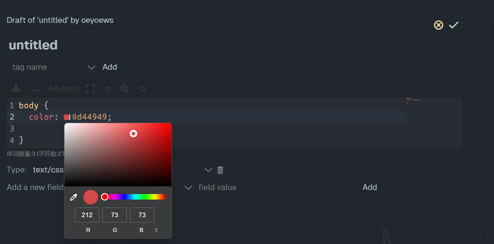
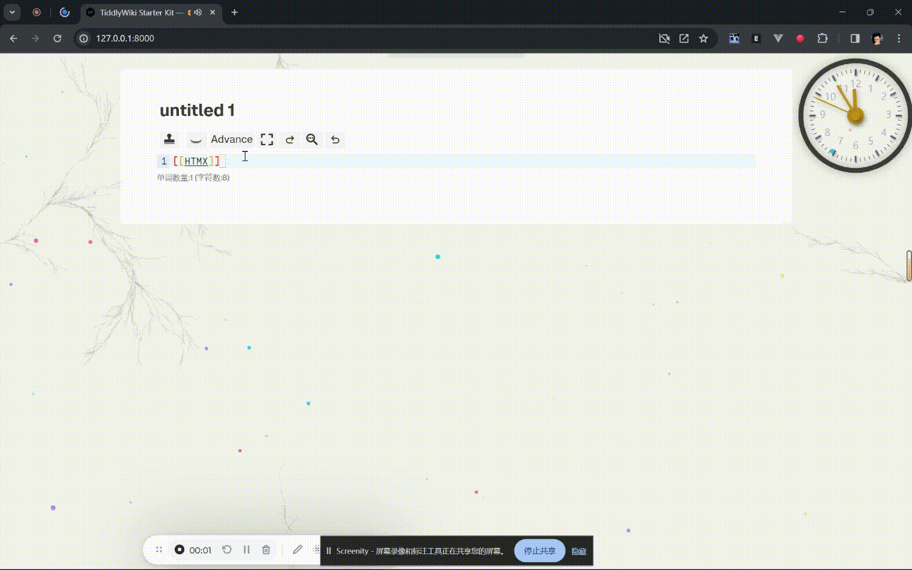

<!-- > [!IMPORTANT]
> tiddlywiki-codemirror-6 插件进入维护状态，接下来主要修复 BUG, 提升插件的兼容性，整体上不会再进行大的改动 (2024-01-24). 如果你想要查看最小版本的 tiddlywiki-codemirror-6 插件，请查看 `basic` 分支。 -->

> [!IMPORTANT]
> The tiddlywiki-codemirror-6 plugin has entered maintenance status. Next, we will mainly fix bugs and improve the compatibility of the plugin. No major changes will be made overall (2024-01-24). If you want to view the smallest version of tiddlywiki-codemirror-6 plugin, please check out the `basic` branch.

https://user-images.githubusercontent.com/72405338/294956491-948b791f-04e1-4447-a5d3-81ebb13619de.mp4

## Preview

- [vercel demo](https://tiddlywiki-codemirror6.vercel.app) or [gh-page demo](https://oeyoews.github.io/tiddlywiki-codemirror6)

| Emoji 补全                   | Wiki Mode                           | 代码片段补全                               |
| ---------------------------- | ----------------------------------- | ------------------------------------------ |
|  |  |  |

| tiddler 补全               | widget 补全                    | 图片补全                     |
| -------------------------- | ------------------------------ | ---------------------------- |
|  |  |  |

| 颜色修改                     | Link 预览                                 |
| ---------------------------- | ----------------------------------------- |
|  |  |
