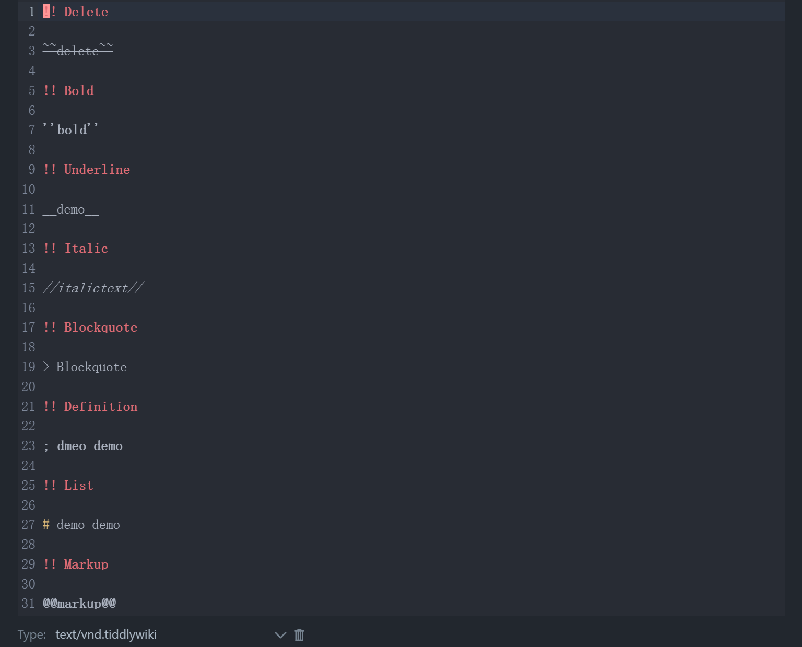

<video width="600" height="400" controls>
  <source src="./assets/demo.mp4" type="video/mp4">
  您的浏览器不支持 video 标签。
</video>

## Emoji 补全

### Wiki Mode

### 代码片段补全

### tiddler 补全

### widget 补全

### 图片补全

### 颜色修改

## Preview

https://tiddlywiki-codemirror6.vercel.app

https://oeyoews.github.io/tiddlywiki-codemirror6
